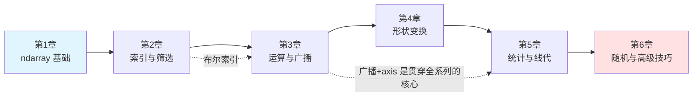

# NumPy 学习系列教程

> 一套从零到进阶的 NumPy 中文教程，共 6 章。每章一个 notebook，代码均已实际运行，配合 mermaid 图示与大量对比表格，深入浅出。

## 📚 章节导航

| 章节 | 文件 | 核心内容 |
|------|------|---------|
| 第 1 章 | [01_NumPy简介与ndarray基础.ipynb](01_NumPy简介与ndarray基础.ipynb) | 为什么 NumPy 快、ndarray 内存模型、数组创建、dtype 体系 |
| 第 2 章 | [02_索引切片与布尔筛选.ipynb](02_索引切片与布尔筛选.ipynb) | 多维索引、切片是视图、花式索引、布尔筛选、np.where |
| 第 3 章 | [03_向量化运算与广播机制.ipynb](03_向量化运算与广播机制.ipynb) | ufunc、广播三规则、向量化性能、原地运算 |
| 第 4 章 | [04_形状变换与数组拼接.ipynb](04_形状变换与数组拼接.ipynb) | reshape、转置、维度增删、拼接/拆分、axis 心智模型 |
| 第 5 章 | [05_统计聚合与线性代数.ipynb](05_统计聚合与线性代数.ipynb) | 聚合函数、NaN 处理、np.linalg、最小二乘实战 |
| 第 6 章 | [06_随机数排序与高级技巧.ipynb](06_随机数排序与高级技巧.ipynb) | default_rng、排序、集合运算、文件 IO、性能实践 |

## 🗺️ 学习路线



## 💡 使用建议

1. **按顺序学习**：后续章节会引用前面章节的概念（尤其是 axis 和广播）
2. **动手运行**：所有代码 cell 均已执行，但建议自己改参数重新跑一遍
3. **完成练习**：每章末尾有 📝 动手练习，是检验理解的最佳方式
4. **关注对比表**：与 Python list、易混淆 API 的对比是本系列的特色

## 环境要求

- Python 3.10+
- NumPy 2.x（本教程基于 NumPy 2.4 编写，使用 `np.random.default_rng` 等现代 API）

```bash
pip install numpy jupyter
```
